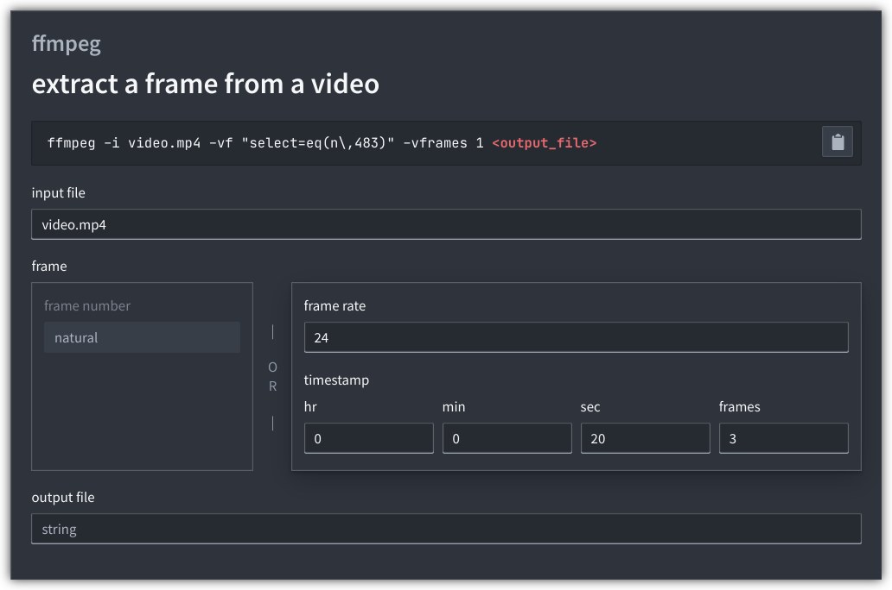

# shell-snippets

Quick website for shell snippets, with or without placeholders.

## Example



Snippets are easy to write and customizable. The example looks like this:

```tsx
<Snippet command="ffmpeg" name="extract a frame from a video">
  <Text>ffmpeg -i </Text>
  <Placeholder name="input file" />
  <Text> -vf "select=eq(n\,</Text>
  <CustomPlaceholder
    name="frame"
    inputs={{ // custom inputs + outputs
      frame: [
        { 'frame number': 'natural' },
        {
          'frame rate': 'positive',
          timestamp: {
            hr: 'natural',
            min: 'natural',
            sec: 'natural',
            frames: 'natural',
          },
        },
      ],
    }}
    render={(values) => { // turn input values into a string
      const { frame } = values
      if ('frame number' in frame) {
        return frame['frame number']
      } else {
        const { 'frame rate': frameRate } = frame
        const { hr, min, sec, frames } = frame.timestamp
        return (hr * 3600 + min * 60 + sec) * frameRate + frames
      }
    }}
  />
  <Text>)" -vframes 1 </Text>
  <Placeholder name="output file" />
</Snippet>
```
